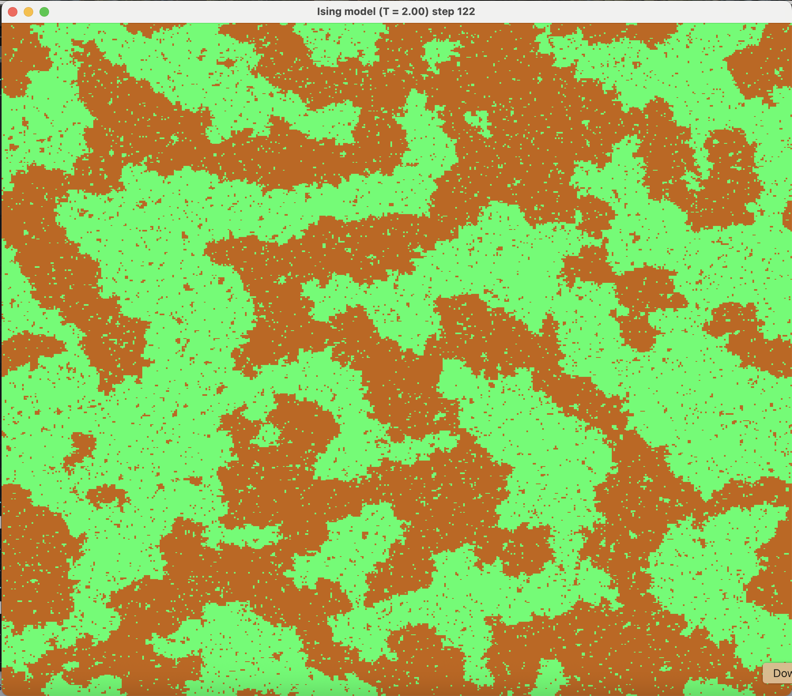
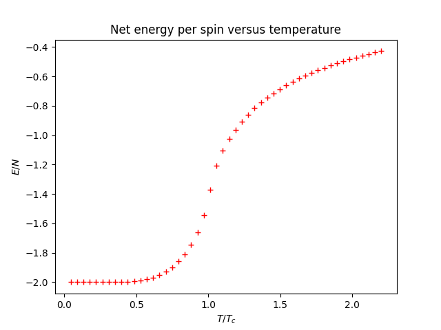
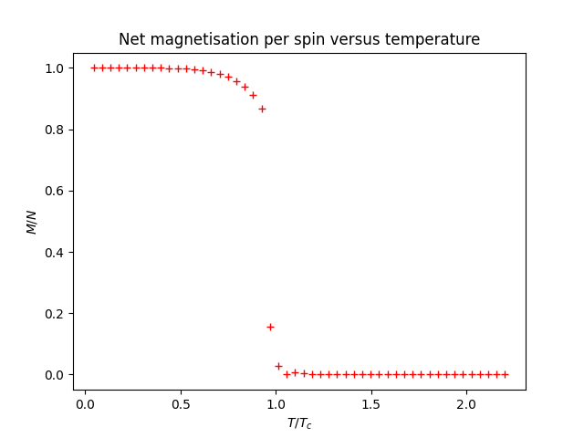
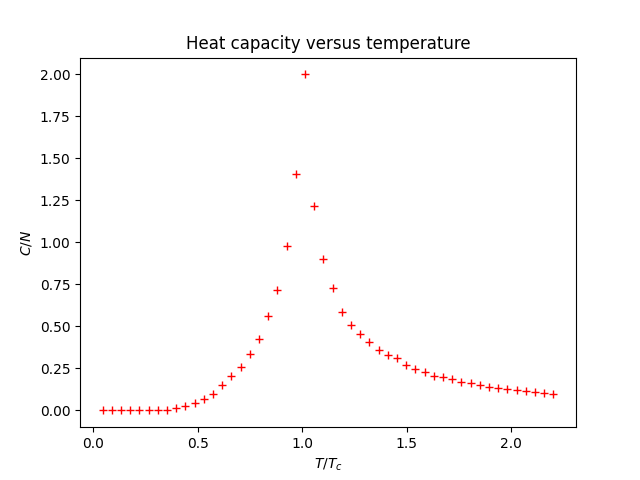

# Readme

## Introduction

This is a GUI application (using [Dear ImGui](https://github.com/ocornut/imgui)) for simulating the 2D [Ising model](https://en.wikipedia.org/wiki/Ising_model) (currently only for no applied magnetic field), using the [Metropolis-Hastings algorithm](https://en.wikipedia.org/wiki/Metropolis%E2%80%93Hastings_algorithm).

It has two modes: a graphical mode with that offers real-time plotting using [implot](https://github.com/epezent/implot) - this is mostly just for show/fun.

It also has a headless "experiment" mode you can use to collect statistics at different temperatures, to investigate e.g. heat capacity as a function of temperature. 

In an attempt support as many platforms as possible, older OpenGL versions are supported, in addition to modern versions. To use modern OpenGL, set `MODERN_GL_ENABLED = 1` in the makefile, or `MODERN_GL_ENABLED = 0` to build for older OpenGL versions.

## Installation

### Mac
You will need the following packages - I assume you will download them with `homebrew`:

`brew install sdl2 glfw glew glm`

### Linux
You will need the following packages: `build-essential`, `libsdl2-dev`, `libglew-dev`, and `libglm-dev`.

### Windows
Windows is not officially supported yet, but it may be possible to get it to run.

## Building
Run the `makefile` with `make` from the project's root directory to build the application. If you get any errors you are likely missing some dependencies.

## Usage
Run `./ising` to start the GUI application. There are some GUI sliders you can use to change the lattice size and temperature.

To run it in the headless "experiment" mode, pass in the `--experiment` flag and specify a list of temperatures to run the simulation at, e.g. `
./ising --experiment 2.1 2.2 2.27 2.3 2.4`. Results will be written to `experiment_summary.txt` for analysis or plotting. The lattice size for the headless mode is 40 (I might make this configurable at some point). This wil genearte a csv file called `experiment_summary.csv` you can use for e.g. plotting.

## Example

Here is a screenshot of the application run on an M4 Macbook pro for 112 steps, at T=2, for a 500x500 lattice:

Here are plots of the net energy per spin, net magnetisation per spin, and heat capacity per spin, showing the expected behaviour (the plotting script is not included in this repo).

